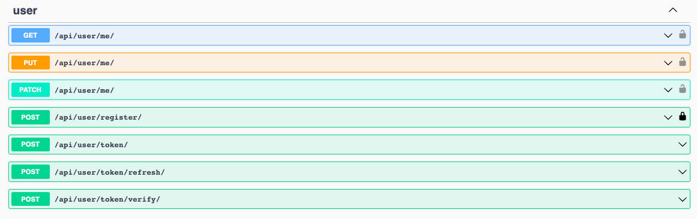

# Social Media API

---
This Django REST framework-based API serves as a RESTful interface for a social media platform.

## How to run

---
```python
git clone https: https://github.com/megah1t/Social_Media_API.git
cd Social_Media_API 
python -m venv venv
source venv/bin/activate # for linux or macOS
venv\Scripts\activate # for Windows
pip install -r requirements.txt
python manage.py migrate
python manage.py runserver
```

## Features

---
* Authentication: Implement a secure method of accessing API endpoints by utilizing JWT token-based authentication.

* Post management: Enable comprehensive CRUD functionality to handle posts, including their creation, retrieval, 
updating, and deletion. Additionally, provide the ability to filter posts based on their hashtags.
* User management: Allow users to register, modify their profile details.
* API documentation: Utilize Swagger UI to automatically generate interactive API documentation, which facilitates developers in effortlessly exploring and testing the API's endpoints.

## API Endpoints

---
The following endpoints are available:

#### User Registration, Authentication and Following
* api/user/register: Register a new user by providing an email and password.
* api/user/token: Receive a token
* api/user/token/refresh/: Refresh a token
* api/user/token/verify/: Verify a token
* api/user/me/: User information

## Documentations

---
 
* api/doc/swagger/: Documentations using Swagger



